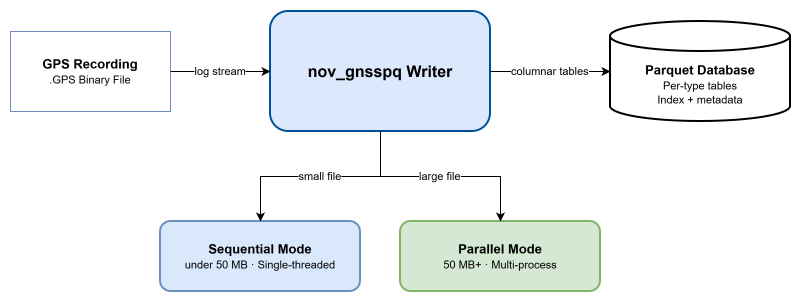

# nov_gnsspq Writer: Conceptual Design

## Overview

The nov_gnsspq writer is the conversion engine at the heart of the nov_gnsspq system.
Its responsibility is to accept a NovAtel Global Navigation Satellite System
(GNSS) recording file and produce a structured, queryable Parquet
database. Once that database exists, all downstream analysis works directly
against it, the original recording is no longer required for repeated queries.

## Core Problem

NovAtel GPS receivers produce recording files (`.GPS`) that pack many message
types, including position fixes, satellite observations, and ephemerides, in a tightly
encoded format. Every time an analyst wants to query even a single field
from this data, the entire file must be decoded from scratch. For recording
sessions spanning hours, days, or weeks, this cost is incurred repeatedly,
making exploratory analysis slow and operationally fragile.

The nov_gnsspq writer solves this by performing the decode once and persisting the
result in a format built for analysis.

## Design Philosophy

The guiding principle is **decode once, query forever**.

GNSS data is decoded a single time and written to Parquet, a columnar storage
format optimised for analytical workloads. Subsequent queries read only the
columns they need, compressed and strongly typed, without ever touching the
original file. This shifts the decoding cost from every query to a one-time
conversion step.

Parquet was chosen deliberately. Its columnar layout means that reading a single
field (for example, latitude from a `BESTPOS` message) scans only that column on
disk, not the entire record. Files are compressed using zstd, and the resulting
tables are immediately readable by standard analytical tools such as pandas,
DuckDB, and Polars with no additional configuration.

## Operational Modes

**Sequential mode** handles files under 50 MB in a single pass. It is
low-overhead and appropriate for short recordings or resource-constrained
environments.

**Parallel mode** applies to files 50 MB and larger. The file is divided into
byte-aligned segments, each processed concurrently across available CPU cores,
and the results are merged into a unified database.

The system selects the appropriate mode automatically based on file size. Users
can override this choice when needed.

> **When to use which mode**
>
> Let the system decide in most cases. Override to sequential if you need
> predictable, minimal resource usage (e.g., embedded or constrained
> deployments).
> Override to parallel if you have a large file and want the fastest possible
> conversion regardless of CPU load.

## Output Structure

The output is a directory of Parquet tables, one per message type encountered in
the recording.

Where NovAtel messages contain nested sub-records, such as satellite observations
within a `RANGE` message, the writer preserves that hierarchy as
related tables. Sub-record tables link back to their parent messages via shared
keys, following the same relational pattern used in standard SQL joins. The full
nested structure of the original data is therefore accessible through table
joins rather than being flattened into a single wide row.

Alongside the Parquet tables, a JSON metadata sidecar captures information about
the source file and the conversion process.

The writer also supports **streaming mode**: messages can be written
incrementally as they arrive from a live GPS receiver, enabling real-time
database construction using the same output structure as file-based conversion.

## Data Integrity

Every database produced by the writer includes a SHA-256 digest of the
source `.GPS` file. This digest, stored in the metadata sidecar, allows any
downstream consumer to verify that a given database was generated from a
specific, unmodified recording; if the source file changes or is substituted,
the digest will not match.

An optional raw-bytes preservation feature can store the original payload
of each message alongside the decoded columns. This enables byte-exact
reconstruction of the source recording from the database alone, which is useful
for audit, validation, or retransmission scenarios.
