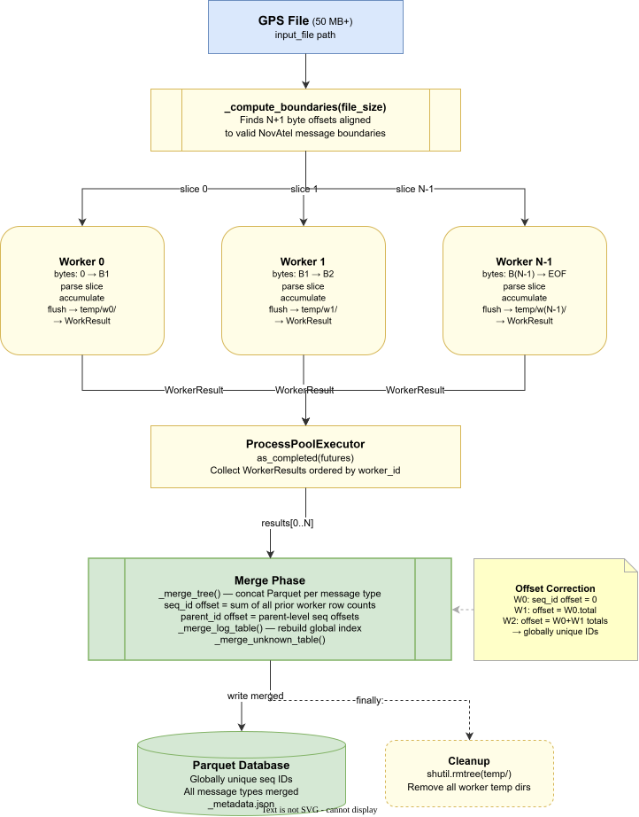
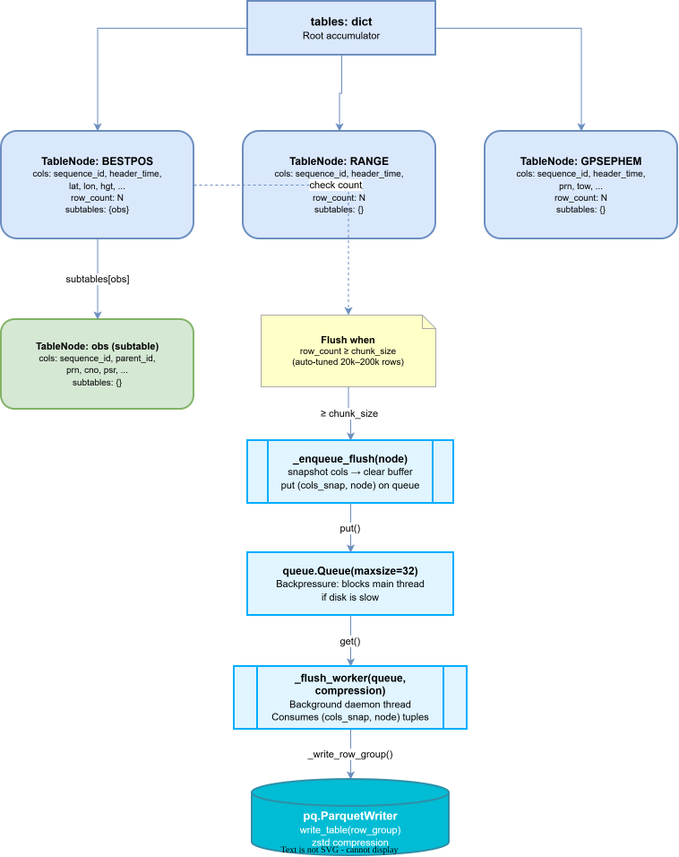

# nov_gnsspq Writer: Detailed Design


## Table of Contents

1. [Overview](#overview)
2. [Class Reference](#class-reference)
   - [PqConverter](#parquetdatabasegenerator-generatorpy)
   - [GPSWriter](#gpswriter-_standardpy)
   - [ParallelGPSWriter](#parallelgpswriter-_parallelpy)
   - [ParallelFileEngine](#parallelfileengine-_enginepy)
   - [Protocol Interfaces](#protocol-interfaces-_protocolspy)
   - [EdieFramerSplitter](#edieframersplitter-_enginepy)
   - [EdieChunkProcessor](#ediechunkprocessor-_enginepy)
   - [ParquetMerger](#parquetmerger-_enginepy)
   - [TableNode](#tablenode-_enginepy)
3. [Data Structures](#data-structures)
4. [Algorithms](#algorithms)
5. [Extension Guide](#extension-guide)
6. [Configuration Reference](#configuration-reference)
7. [Output File Structure](#output-file-structure)
8. [Error Handling](#error-handling)

---

## Overview

The writer subsystem converts NovAtel Global Navigation Satellite System (GNSS) binary log files into a columnar Parquet database. It is organised across five modules:

- `generator.py`: public entry point (`PqConverter`), routes to file or streaming mode.
- `_standard.py`: single-threaded writer (`GPSWriter`), used for files under 50 MB or when forced.
- `_parallel.py`: thin wrapper (`ParallelGPSWriter`) that assembles the default EDIE+Parquet engine and handles SHA-256 and metadata concerns.
- `_protocols.py`: protocol interfaces (`BoundarySplitter`, `ChunkProcessor`, `ResultMerger`) with no intra-package imports; safe to import without EDIE or PyArrow.
- `_engine.py`: parallel engine core, containing `ParallelFileEngine`, the three default implementations (`EdieFramerSplitter`, `EdieChunkProcessor`, `ParquetMerger`), `WorkerResult`, `TableNode`, flush infrastructure, worker functions, and all module-level helpers required for `multiprocessing` picklability.

All decoded messages in the EDIE path are stored in a tree of `TableNode` objects. Each node holds column buffers for one log type, and nested fields, including dicts and lists of dicts, become child nodes whose rows reference their parent via a `parent_id` column.

---

## Class Reference

### PqConverter (`generator.py`)

The public facade. Must be used as a context manager. On entry it creates the output directory; on exit (no exception) it finalizes streaming writes.

```python
class PqConverter:
    def __init__(
        self,
        output_dir: str | Path,
        overwrite: bool = False,
        parallel: bool | None = None,
        zip_output: bool = False,
    ) -> None
```

**Constructor parameters**

| Parameter | Type | Default | Description |
|---|---|---|---|
| `output_dir` | `str \| Path` | — | Root directory for the Parquet database. Created if absent. |
| `overwrite` | `bool` | `False` | Allow writing into a directory that already contains `_metadata.json`. |
| `parallel` | `bool \| None` | `None` | `True` forces `ParallelGPSWriter`; `False` forces `GPSWriter`; `None` auto-selects based on file size against `PARALLEL_MIN_BYTES`. |
| `zip_output` | `bool` | `False` | Compress the output directory into `{output_dir}.zip` (ZIP_DEFLATED) after writing completes. Called by both `consume` (file mode) and `__exit__` (streaming mode). The original directory is preserved. |

**Public methods**

```python
def consume(self, source: str | Path | ne.FileParser | Iterable) -> None
def write(self, record: ne.Message | ne.UnknownMessage | ne.UnknownBytes) -> None
def write_to_db(self, source: str | Path | ne.FileParser) -> None
```

- `consume` dispatches to file mode when `source` is a `str`, `Path`, or `ne.FileParser` with a resolvable path attribute (checked in order: `file_path`, `_file_path`, `filename`, `path`). Any other iterable triggers streaming mode.
- `write` adds a single record in streaming mode. Both `consume` and `write` raise `RuntimeError` if called outside the `with` block.
- `write_to_db` is a file-mode-only convenience alias; it does not raise if called outside a context manager.

**Module-level utility**

```python
def zip_database(output_dir: str | Path) -> Path
```

Compresses the Parquet database directory into `{output_dir.parent}/{output_dir.name}.zip` using ZIP_DEFLATED. The archive unpacks to a directory with the same name as `output_dir`. The original directory is preserved. Called internally when `zip_output=True`; also importable directly.

**Key private methods**

```python
@staticmethod
def _extract_file_path(source) -> str | None
def _run_file_writer(self, file_path: str) -> None
def _write_record(self, record) -> None
def _finalize(self) -> None
```

`_run_file_writer` instantiates the appropriate writer class, calls `write_to_db()` on it, and wraps any `OSError` in a `WriteError`. `_finalize` is called only by `__exit__` in streaming mode (when `self._writer is None`); it flushes remaining buffers, writes `log_table.parquet` and `unknown_data.parquet`, then serializes `_metadata.json`. `__exit__` does **not** call `_finalize` when an exception is active.

**Streaming-mode internal state**

| Attribute | Type | Purpose |
|---|---|---|
| `_tables` | `dict[str, TableNode]` | Live tree of TableNodes, keyed by log type |
| `_sequence_id` | `int` | Global message counter; increments for every record |
| `_log_table_cols` | `dict` | `{"log": [...], "sequence_id": [...]}`, the message-type index |
| `_unknown_cols` | `dict` | `{"sequence_id": [...], "payload": [...]}`, the unrecognised payloads buffer |

Streaming mode uses a hardcoded `chunk_size` of `50_000` rows when deciding whether to flush a subtree after each `ne.Message`.

---

### GPSWriter (`_standard.py`)

`GPSWriter` implements a single-threaded parse-accumulate-flush pipeline and starts a background daemon thread on construction to handle disk I/O.

```python
class GPSWriter:
    def __init__(
        self,
        input_file: str,
        output_folder: str,
        workers: int | None = None,
        chunk_size: int | None = None,
        compression: str = "zstd",
    ) -> None
```

`workers` is accepted but unused (reserved for a future change). `chunk_size` defaults to the result of `_auto_tune`. Compression is passed through to all `pq.ParquetWriter` and `pq.write_table` calls.

**Public method**

```python
def write_to_db(self) -> None
```

Full pipeline: open `ne.FileParser` → iterate messages → call `_add_entry` → periodic `_maybe_flush_subtree` → `_flush_all_remaining` → drain queue → `_close_all_writers` → write terminal tables → write metadata.

**Key private methods**

```python
def _add_entry(
    self,
    message: dict,
    table: dict[str, TableNode],
    log_type: str,
    parent_id: int | None,
    _parent_output_dir: str,
) -> None

def _process_value(
    self,
    value: Any,
    field: str,
    cols: dict[str, list],
    row_count: int,
) -> None

def _enqueue_flush(self, node: TableNode) -> None
def _flush_all_remaining(self) -> None
def _flush_subtree_unconditional(self, tables: dict[str, TableNode]) -> None
def _maybe_flush_subtree(self, node: TableNode) -> None
def _get_seq_id(self, node: TableNode, parent_id: int | None) -> int
def _close_all_writers(self, tables: dict[str, TableNode]) -> None

def _write_log_table(self) -> None
def _write_unknown_table(self) -> None
def _write_raw_table(self) -> None
def _write_metadata(self, file_size: int, sha256: str, total_messages: int) -> None

@staticmethod
def _compute_sha256(path: str) -> str
```

**Flush queue**

`_flush_queue = queue.Queue(maxsize=32)`. The main parse thread calls `_enqueue_flush(node)`, which snapshots column buffers into a new dict, clears the originals, resets `node.row_count` to 0, and puts `(cols_snap, node)` on the queue. If the queue is full (disk slower than parse) the `put` call blocks, providing natural backpressure. The background `_flush_worker` loop dequeues items and calls `_write_row_group`. Shutdown sequence: `queue.join()` (drain), `queue.put(_SENTINEL)`, `queue.join()`, `thread.join()`.

**Flush counter**

`_flush_ctr` increments on every message. At 500 it resets to 0 and calls `_maybe_flush_subtree` on the node for the current `log_type`. This bounds memory usage without a per-message check.

**Terminal table filenames**

| File | Name |
|---|---|
| Log table | `{os.path.basename(output_folder)}.parquet` |
| Unknown data | `unknown_data.parquet` |
| Metadata | `_metadata.json` |

---

### ParallelGPSWriter (`_parallel.py`)



`ParallelGPSWriter` splits the input file into byte-range slices and dispatches one `_worker_process` per slice via `ProcessPoolExecutor`, then merges the results into the final database. It falls back to `GPSWriter` for files under `PARALLEL_MIN_BYTES`.

```python
class ParallelGPSWriter:
    def __init__(
        self,
        input_file: str,
        output_folder: str,
        num_workers: int | None = None,
        chunk_size: int | None = None,
        compression: str = "zstd",
    ) -> None
```

**Public method**

```python
def write_to_db(self) -> None
```

Pipeline: check file size → compute SHA-256 (reusing `GPSWriter._compute_sha256`) → compute boundaries → create temp dir → submit workers → await results → merge tree → merge log/unknown tables → write metadata → delete temp dir (in `finally`).

The temp directory prefix is `_pgps_workers_` (from `tempfile.mkdtemp`). It is always removed in the `finally` block regardless of exceptions.

**Key private method**

```python
def _compute_boundaries(self, file_size: int) -> list[int]
```

Returns a deduplicated list of byte offsets with at least two entries (0 and `file_size`). See [Boundary Finding](#boundary-finding) below.

**Worker args dict keys**

`worker_id`, `input_file`, `start_byte`, `end_byte`, `worker_output_dir`, `compression`, `chunk_size`

**WorkerResult dict keys**

`worker_id`, `total_messages`, `worker_output_dir`, `table_tree`, `log_table_path`, `unknown_path`

**Metadata extra field (parallel only)**

`parallel_workers: int`, the actual worker count after deduplication.

---

### ParallelFileEngine (`_engine.py`)

`ParallelFileEngine` is the generic parallel file-processing orchestrator. It accepts optional pluggable components and falls back to the EDIE+Parquet defaults when any are `None`.

```python
class ParallelFileEngine:
    def __init__(
        self,
        splitter: BoundarySplitter | None = None,
        processor: ChunkProcessor | None = None,
        merger: ResultMerger | None = None,
        num_workers: int | None = None,
    ) -> None

    def run(self, file_path: Path | str, output_dir: Path | str) -> None
```

**Constructor parameters**

| Parameter | Type | Default | Description |
|---|---|---|---|
| `splitter` | `BoundarySplitter \| None` | `EdieFramerSplitter()` | Snaps candidate byte offsets to valid record boundaries. |
| `processor` | `ChunkProcessor \| None` | `EdieChunkProcessor()` | Decodes and stores one byte-range slice per worker. |
| `merger` | `ResultMerger \| None` | `ParquetMerger()` | Combines per-worker outputs into the final result. |
| `num_workers` | `int \| None` | `None` | Worker count. `None` = auto-tuned in `run()` via `clamp(cpu_count - 1, 2, 8)`. |

**`run` behaviour**

1. Resolves `num_workers` if `None` using CPU count.
2. Computes `num_workers + 1` boundary offsets by calling `splitter.snap_boundary` for each interior point; deduplicates to produce `actual_workers` slices.
3. Creates a temp directory (`_pfe_workers_*`) with one subdirectory per worker.
4. Submits `actual_workers` futures to `ProcessPoolExecutor`, each calling `_engine_dispatch_worker(processor, file_path, start, end, worker_id, temp_dir)`.
5. As futures complete, catches any worker exception and re-raises as `ParallelEngineError(worker_id=k, byte_range=(start, end))` with the original exception chained.
6. Sorts results ascending by `worker_id` (regardless of completion order).
7. Calls `merger.merge(results, output_dir)`.
8. Removes the temp directory unconditionally in a `finally` block.

**Attribute**

`_last_actual_workers: int`, the worker count used in the most recent `run()` call. `ParallelGPSWriter` reads this to write `parallel_workers` to `_metadata.json`.

---

### Protocol Interfaces (`_protocols.py`)

The three protocols are defined with `typing.Protocol` and `@runtime_checkable`. Conformance is structural: implementations do not declare inheritance. `isinstance(obj, BoundarySplitter)` works at runtime because of `@runtime_checkable`.

```python
class BoundarySplitter(Protocol):
    def snap_boundary(self, file_path: Path, candidate_offset: int) -> int: ...

class ChunkProcessor(Protocol):
    def process(
        self,
        file_path: Path,
        start_byte: int,
        end_byte: int,
        worker_id: int,
        temp_dir: Path,
    ) -> Any: ...

class ResultMerger(Protocol):
    def merge(self, worker_results: list[Any], output_dir: Path) -> None: ...
```

All three are exported from `nov_gnsspq.writer`. The file has no imports from elsewhere in the package, preserving the guarantee that importing these types does not load EDIE or PyArrow.

**Pickling constraint:** every implementation must be picklable. `ProcessPoolExecutor` serialises instances across process boundaries. Hold only primitive configuration values in `__init__`, with no open file handles, locks, or threading primitives.

---

### EdieFramerSplitter (`_engine.py`)

The default `BoundarySplitter`. Wraps `_find_message_boundary`, which reads up to 65 536 bytes ahead of `candidate_offset` through a `novatel_edie.Framer` and returns the offset of the first non-UNKNOWN frame. If no valid frame is found within the search window it returns `candidate_offset` unchanged; if `candidate_offset >= file_size` it returns `file_size`, signalling a zero-length final chunk.

```python
class EdieFramerSplitter:
    def snap_boundary(self, file_path: Path | str, candidate_offset: int) -> int: ...
```

No constructor arguments. Picklable because it holds no state.

---

### EdieChunkProcessor (`_engine.py`)

The default `ChunkProcessor`. Wraps `_worker_process`, the top-level picklable function that executes inside each worker process.

```python
class EdieChunkProcessor:
    def __init__(
        self,
        chunk_size: int | None = None,
        compression: str = "zstd",
    ) -> None

    def process(
        self,
        file_path: Path | str,
        start_byte: int,
        end_byte: int,
        worker_id: int,
        temp_dir: Path | str,
    ) -> WorkerResult: ...
```

**Constructor parameters**

| Parameter | Type | Default | Description |
|---|---|---|---|
| `chunk_size` | `int \| None` | `None` | Row flush threshold. `None` = auto-tuned from file size on first `process` call. |
| `compression` | `str` | `"zstd"` | Parquet compression codec for per-worker output. |

`process` extracts the byte range to a temporary file, opens a `ne.FileParser` over it, accumulates decoded messages into a `TableNode` tree, flushes to per-worker Parquet files under `temp_dir`, and returns a `WorkerResult`. The temporary slice file is deleted in a `finally` block.

---

### ParquetMerger (`_engine.py`)

The default `ResultMerger`. Wraps `_merge_tree`, `_merge_log_table`, and `_merge_unknown_table`.

```python
class ParquetMerger:
    def __init__(self, compression: str = "zstd") -> None

    def merge(self, worker_results: list[WorkerResult], output_dir: Path | str) -> None: ...
```

`merge` runs three phases in order: data table merge (recursive tree with `sequence_id`/`parent_id` offset correction), log table merge (global sequence offset), and unknown table merge. The `compression` codec is applied to all final `pq.write_table` calls.

---

### TableNode (`_engine.py`)



`TableNode` is the per-log-type accumulation node. It uses `__slots__` rather than the default `__dict__`, yielding approximately 20% faster attribute access on the hot path.

```python
class TableNode:
    __slots__ = (
        "cols", "last_parent_id", "last_seq_id", "log_type",
        "output_dir", "parquet_writer", "row_count", "safe_path",
        "schema_cached", "subtables",
    )

    def __init__(self, safe_path: str, output_dir: str, log_type: str) -> None
```

**Slot types and semantics**

| Slot | Type | Semantics |
|---|---|---|
| `cols` | `dict[str, list]` | Column name to value list; lists grown in lockstep, nulls back-filled with `None` on new column creation |
| `subtables` | `dict[str, TableNode]` | Child nodes keyed by sub-log-type (nested dict fields or list-of-dict items) |
| `last_seq_id` | `int \| None` | Sequence id of the last inserted row; `None` before any row exists |
| `last_parent_id` | `int \| None` | Parent id of the last inserted row |
| `safe_path` | `str` | Relative path with OS separators replaced by `__`, used as a unique merge key |
| `output_dir` | `str` | Absolute directory where `{log_type}.parquet` is written |
| `log_type` | `str` | Log-type name (e.g. `"BESTPOS"`) |
| `row_count` | `int` | Rows currently in `cols`; reset to 0 after each flush |
| `parquet_writer` | `pq.ParquetWriter \| None` | Single writer per node, created on first flush, kept open for append |
| `schema_cached` | `pa.Schema \| None` | Schema from first flush; used for type-consistent subsequent row-group writes |

`schema_cached` acts as a type lock. If a subsequent flush cannot match the cached schema (due to `ArrowInvalid`, `ArrowTypeError`, or `ArrowNotImplementedError`), the table is rebuilt without the schema and `schema_cached` is updated to the new inferred schema.

---

## Data Structures

### WorkerResult

`WorkerResult` is a `TypedDict` returned by `EdieChunkProcessor.process` (and by the underlying `_worker_process`). It is exported from `nov_gnsspq.writer` for Tier 1 callers who supply a custom `ResultMerger` alongside the default `EdieChunkProcessor`.

```python
class WorkerResult(TypedDict):
    worker_id: int
    total_messages: int          # sequence_id counter value at end of slice
    worker_output_dir: str
    table_tree: dict             # recursive {log_type: {row_count, parquet_path, subtables}}
    log_table_path: str          # absolute path to log_table_w{k}.parquet
    unknown_path: str            # absolute path to unknown_w{k}.parquet
```

The engine does not validate that a custom `ResultMerger` is compatible with a custom `ChunkProcessor`'s return type. When mixing default and custom components, the return value schema is the processor's responsibility.

### Column Buffers

Inside a `TableNode`, the `cols` dictionary grows one entry per field encountered:

- `sequence_id`, always present; appended before iterating message fields.
- `parent_id`, present only when `parent_id is not None` (i.e. for all non-root nodes).
- Field columns, one list per scalar field; new columns are back-filled with `[None] * row_count` to maintain equal-length lists.
- Enum columns, where `"{field}"` holds `str(value)` and `"{field}_raw"` holds `int(value)`.
- SatelliteId columns, expanded inline as `"{field}_{sub_key}"` entries.

The `_log_table_cols` and `_unknown_cols` buffers are written only at finalization (GPSWriter, streaming mode) and never flushed incrementally.

### _metadata.json

Written by both writers. `GPSWriter` (and streaming mode) produces:

```json
{
  "source_filename": "recording.GPS",
  "file_size": 12345678,
  "sha256": "abc123...",
  "total_message_count": 500000,
  "schema_version": "5",
  "writer_version": "5.1.0"
}
```

`ParallelGPSWriter` adds one field:

```json
  "parallel_workers": 4
```

Streaming mode (`PqConverter._finalize`) omits `source_filename`, `file_size`, `sha256`, and `parallel_workers`.

---

## Algorithms

### Auto-Tune

`_auto_tune` is called by both `GPSWriter` and `ParallelGPSWriter` to derive the default `chunk_size` and `workers` values from the input file size and available CPU count.

```python
cpu = os.cpu_count() or 4
file_bytes = os.path.getsize(input_file)
est_messages = max(1, file_bytes // 500)
workers = min(max(2, cpu - 1), 8)

raw_chunk = est_messages // max(1, workers * 8)
chunk_size = max(20_000, min(200_000, raw_chunk))

if file_bytes > 1_073_741_824:   # 1 GB
    chunk_size = max(chunk_size, 200_000)

return {"workers": workers, "chunk_size": chunk_size, "est_messages": est_messages}
```

The formula assumes ~500 bytes per message. Worker count is clamped to `[2, 8]`. Chunk size is clamped to `[20_000, 200_000]`, with the lower bound raised to 200,000 for files over 1 GB to reduce row-group overhead.

### Boundary Finding

`_find_message_boundary(filepath, approx_offset, search_window=65536)` snaps a given byte offset to the nearest valid NovAtel message start:

1. Compute `read_end = min(file_size, approx_offset + 65536)`.
2. Read bytes `[approx_offset, read_end)`.
3. Feed through `ne.Framer` with `report_unknown_bytes=True`.
4. Accumulate `skipped` bytes from frames with `HEADER_FORMAT.UNKNOWN`.
5. Return `approx_offset + skipped` on the first non-UNKNOWN frame.
6. Fall back to `approx_offset` if no valid frame is found.

`_compute_boundaries` in `ParallelGPSWriter` calls this for each of `N − 1` interior split points, then deduplicates adjacent equal values to reduce worker count when large invalid sections exist.

### Chunked Flushing (GPSWriter / worker)

Every 500 messages, the subtree rooted at the current `log_type`'s node is checked via `_maybe_flush_subtree`:

```
if node.row_count >= chunk_size:
    enqueue_flush(node)
for each child subtable:
    recurse
```

At end-of-parse, `_flush_all_remaining` unconditionally enqueues every node with `row_count > 0`. The background `_flush_worker` thread dequeues `(cols_snap, node)` tuples and calls `_write_row_group`. The queue's `maxsize=32` provides backpressure when disk is the bottleneck.

### Sequence ID Assignment (`_get_seq_id` / `_w_get_seq_id`)

```
if node.last_seq_id is None:
    return 0
if (not node.subtables) and (node.last_parent_id != parent_id):
    return 0
return node.last_seq_id + 1
```

Leaf nodes without subtables reset their sequence counter when their parent changes, ensuring that child rows within a single parent are numbered from 0. Interior nodes (with subtables) never reset, keeping their IDs globally monotonic within the worker slice.

### Parallel Merge: Offset Correction

After all workers complete, `_merge_tree` recursively merges per-worker Parquet files for each log type. Because each worker independently numbers its rows from 0, all `sequence_id` and `parent_id` values must be corrected with per-worker offsets before concatenation.

For each log type at a given tree level:

```
seq_offsets[0] = 0
seq_offsets[k] = seq_offsets[k-1] + worker_row_counts[k-1]   (for k >= 1)
```

`parent_seq_offsets` are propagated downward from the parent level's `seq_offsets`.

`_apply_offsets(table, seq_offset, parent_offset, is_leaf)` applies the corrections:

- **Root nodes** (no `parent_id` column): add `seq_offset` to `sequence_id` only.
- **Leaf nodes** (is_leaf=True, non-root): add `parent_offset` to `parent_id` only; `sequence_id` is not adjusted because leaf rows are not referenced as parents.
- **Interior non-root nodes**: add `seq_offset` to `sequence_id` and `parent_offset` to `parent_id`.

The log, unknown, and raw tables are merged separately using a simple global cumulative offset over `total_messages` from each worker's `WorkerResult`.

### Value Type Dispatch (`_w_process_value` / `GPSWriter._process_value`)

```
1. type(value) in {int, float, str, bool, NoneType}  →  store directly
2. type(type(value)).__name__ == "EnumerationType"   →  str(value) + int(value) in {field}_raw
3. type(type(value)).__name__ == "PyCStructType":
       isinstance(value, ne.SatelliteId)             →  expand via to_dict() as {field}_{key}
       hasattr(value, "value") and bytes              →  store bytes directly
       hasattr(value, "value")                        →  str(value)
       else                                           →  store as-is
4. isinstance(value, enum.Enum)                      →  str(value) + value.value in {field}_raw
5. hasattr(value, "value")                           →  str(value)
6. fallback                                          →  store as-is
```

---

## Extension Guide

`ParallelFileEngine` supports four tiers of customisation, from zero changes to fully custom binary format support. In all tiers the engine handles worker count resolution, boundary splitting, `ProcessPoolExecutor` dispatch, result sorting, and error wrapping. Components that are not supplied fall back to the EDIE+Parquet defaults.

### Tier 0: Default behaviour

```python
from nov_gnsspq.writer import PqConverter

with PqConverter("output/") as db:
    db.consume("recording.GPS")
```

No changes required. `PqConverter` auto-selects `ParallelGPSWriter` for files ≥ 50 MB.

---

### Tier 1: Custom storage, keep EDIE decoding

Supply a `ResultMerger` to write decoded NovAtel data to a non-Parquet backend. The merger receives `list[WorkerResult]`; import `WorkerResult` for the type annotation.

```python
from nov_gnsspq.writer import ParallelFileEngine, WorkerResult
from pathlib import Path
import sqlite3

class SQLiteMerger:
    def __init__(self, db_path: str):
        self._db_path = db_path  # str, so picklable

    def merge(self, worker_results: list[WorkerResult], output_dir: Path) -> None:
        conn = sqlite3.connect(self._db_path)
        for result in worker_results:
            for log_type, info in result["table_tree"].items():
                if info["parquet_path"]:
                    import pyarrow.parquet as pq
                    tbl = pq.read_table(info["parquet_path"])
                    tbl.to_pandas().to_sql(log_type, conn, if_exists="append", index=False)
        conn.commit()
        conn.close()

engine = ParallelFileEngine(merger=SQLiteMerger("gnss.db"))
engine.run("recording.GPS", "output/")
```

---

### Tier 2: Custom decoder and storage

Supply both a `ChunkProcessor` and a `ResultMerger` when the decoding logic or output format differs. The processor writes intermediate output under `temp_dir` and returns any value; the merger receives that value verbatim.

```python
from nov_gnsspq.writer import ParallelFileEngine
from pathlib import Path
import json

class JsonChunkProcessor:
    def __init__(self, types: list[str]):
        self._types = types  # list[str], picklable

    def process(self, file_path: Path, start_byte: int, end_byte: int,
                worker_id: int, temp_dir: Path) -> Path:
        import novatel_edie as ne
        import tempfile, os

        slice_size = end_byte - start_byte
        tmp = temp_dir / f"slice_w{worker_id}.GPS"
        tmp.parent.mkdir(parents=True, exist_ok=True)
        with open(file_path, "rb") as src, open(tmp, "wb") as dst:
            src.seek(start_byte)
            dst.write(src.read(slice_size))

        records = []
        for msg in ne.FileParser(str(tmp)):
            if isinstance(msg, ne.Message) and msg.name in self._types:
                records.append({"type": msg.name, "data": msg.to_dict()})
        tmp.unlink()

        out = temp_dir / f"w{worker_id}.json"
        out.write_text(json.dumps(records))
        return out

class JsonMerger:
    def merge(self, worker_results: list[Path], output_dir: Path) -> None:
        records = []
        for path in worker_results:
            records.extend(json.loads(path.read_text()))
        (output_dir / "result.json").write_text(json.dumps(records, indent=2))

engine = ParallelFileEngine(
    processor=JsonChunkProcessor(types=["BESTPOS", "RANGE"]),
    merger=JsonMerger(),
)
engine.run("recording.GPS", "output/")
```

---

### Tier 3: Fully custom binary format

Supply all three components to process a non-NovAtel binary file. The splitter locates valid record boundaries in your framing; the processor decodes one byte range; the merger assembles the outputs.

```python
from nov_gnsspq.writer import ParallelFileEngine
from pathlib import Path

SYNC = b"\xAB\xCD"  # example custom frame sync marker

class CustomSplitter:
    def snap_boundary(self, file_path: Path, candidate_offset: int) -> int:
        data = file_path.read_bytes()
        pos = data.find(SYNC, candidate_offset)
        return pos if pos != -1 else len(data)

class CustomProcessor:
    def __init__(self, schema: dict):
        self._schema = schema  # dict of picklable values

    def process(self, file_path: Path, start_byte: int, end_byte: int,
                worker_id: int, temp_dir: Path):
        raw = file_path.read_bytes()[start_byte:end_byte]
        records = self._decode(raw)
        out = temp_dir / f"w{worker_id}.json"
        out.parent.mkdir(parents=True, exist_ok=True)
        out.write_text(json.dumps(records))
        return {"worker_id": worker_id, "path": str(out), "count": len(records)}

    def _decode(self, raw: bytes) -> list:
        # custom frame parsing logic
        ...

class CustomMerger:
    def merge(self, worker_results: list, output_dir: Path) -> None:
        all_records = []
        for r in worker_results:
            all_records.extend(json.loads(Path(r["path"]).read_text()))
        (output_dir / "output.json").write_text(json.dumps(all_records))

engine = ParallelFileEngine(
    splitter=CustomSplitter(),
    processor=CustomProcessor(schema={"endian": "little"}),
    merger=CustomMerger(),
    num_workers=4,
)
engine.run("custom_format.bin", "output/")
```

### Pickling Checklist

Before using a custom component across worker processes:

- Constructor args are strings, ints, booleans, `Path` objects, or plain dicts/lists of those types.
- No `lambda` functions, closures, or local classes defined inside functions.
- No open file handles, network connections, or locks stored as instance attributes.
- `pickle.dumps(instance)` raises no exception.

---

## Configuration Reference

| Constant | Location | Value | Description |
|---|---|---|---|
| `HEADER_PREFIX` | `reader/schema.py` | `"header_"` | Prepended to every header field name |
| `SEQUENCE_ID_COL` | `reader/schema.py` | `"sequence_id"` | Row ordering column name |
| `PARENT_ID_COL` | `reader/schema.py` | `"parent_id"` | Foreign-key column name in sub-tables |
| `SCHEMA_VERSION` | `reader/schema.py` | `"5"` | Written to `_metadata.json` |
| `WRITER_VERSION` | `reader/schema.py` | `"5.1.0"` | Written to `_metadata.json` |
| `METADATA_FILENAME` | `reader/schema.py` | `"_metadata.json"` | Sidecar file name |
| `PARALLEL_MIN_BYTES` | `_engine.py` | `52_428_800` (50 MB) | Files at or above this size use `ParallelGPSWriter` |
| `_1_GB` | `_engine.py` | `1_073_741_824` | Threshold that raises minimum chunk size to 200,000 |
| `_SENTINEL` | `_engine.py` | `object()` | Poison-pill value to stop the flush thread |
| `_FAST_TYPES` | `_engine.py` | `frozenset({int, float, str, bool, NoneType})` | Types stored directly without dispatch overhead |
| Compression default | `_standard.py`, `_parallel.py` | `"zstd"` | PyArrow default level 3 |
| Flush queue maxsize | `_standard.py` | `32` | Backpressure limit on queued row groups |
| Flush counter period | `_standard.py`, `_engine.py` | `500` | Messages between subtree flush checks |
| Streaming chunk size | `generator.py` | `50_000` | Hardcoded flush threshold in streaming mode |
| Boundary search window | `_engine.py` | `65_536` bytes | Max scan ahead in `_find_message_boundary` |
| Min chunk size | `_engine.py` | `20_000` | Lower bound from `_auto_tune` |
| Max chunk size | `_engine.py` | `200_000` | Upper bound from `_auto_tune` |
| Max workers | `_engine.py` | `8` | Upper bound from `_auto_tune` |
| Temp dir prefix | `_engine.py` | `"_pfe_workers_"` | Prefix for `tempfile.mkdtemp` in `ParallelFileEngine.run` |

---

## Output File Structure

```
{output_folder}/
├── {db_name}.parquet          ← log_table: "log" (str), "sequence_id" (int64)
├── _metadata.json             ← SHA-256, counts, schema/writer versions
├── unknown_data.parquet       ← "sequence_id" (int64), "payload" (binary)
├── BESTPOS/
│   ├── BESTPOS.parquet
│   └── obs/
│       └── obs.parquet        ← sub-table for nested list field
├── RANGE/
│   └── RANGE.parquet
└── GPSEPHEM/
    └── GPSEPHEM.parquet
```

Each message-type directory mirrors the log-type name exactly as returned by `message.name`. Sub-tables are created for nested dicts and lists-of-dicts; their directory names match the field name in the parent message. The `safe_path` attribute on `TableNode` represents the relative path with OS separators replaced by `__`, used as a stable merge key during parallel consolidation.

The `{db_name}.parquet` log table filename is derived from `os.path.basename(output_folder)`. It contains one row per parsed message in arrival order, providing a type index for selective column loading.

---

## Error Handling

| Exception | Raised by | Condition |
|---|---|---|
| `DatabaseExistsError` | `PqConverter.__enter__` | `_metadata.json` already exists in `output_dir` and `overwrite=False` |
| `WriteError` | `PqConverter._run_file_writer` | Wraps `OSError` from the underlying writer's `write_to_db()` call |
| `RuntimeError` | `PqConverter.consume`, `.write` | Called outside a `with` block |
| `ParallelEngineError` | `ParallelFileEngine.run` | Any worker process raises; carries `worker_id: int` and `byte_range: tuple[int, int]`; original exception is chained via `raise ... from original` |

`PqConverter.__exit__` does not call `_finalize` when `exc_type is not None`, which leaves partial output on disk without emitting `_metadata.json`. Callers can detect an incomplete database by testing for the absence of this file.

The parallel temp directory (`_pgps_workers_*`) is always removed in a `finally` block, even when a worker raises. Schema type mismatches during `_write_row_group` are handled by falling back to schema inference and updating `schema_cached`, rather than raising an exception, tolerating heterogeneous field types across messages of the same log type.
