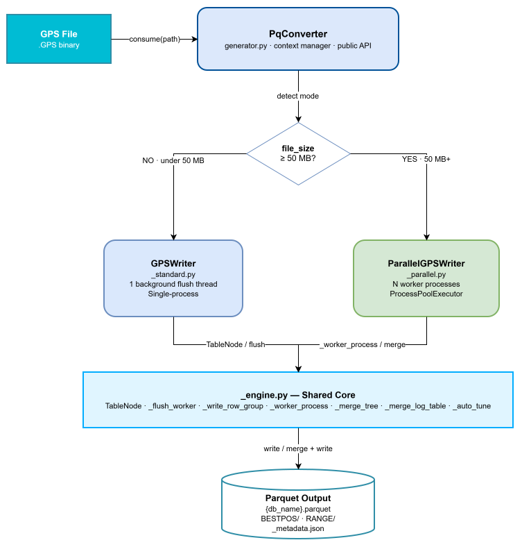
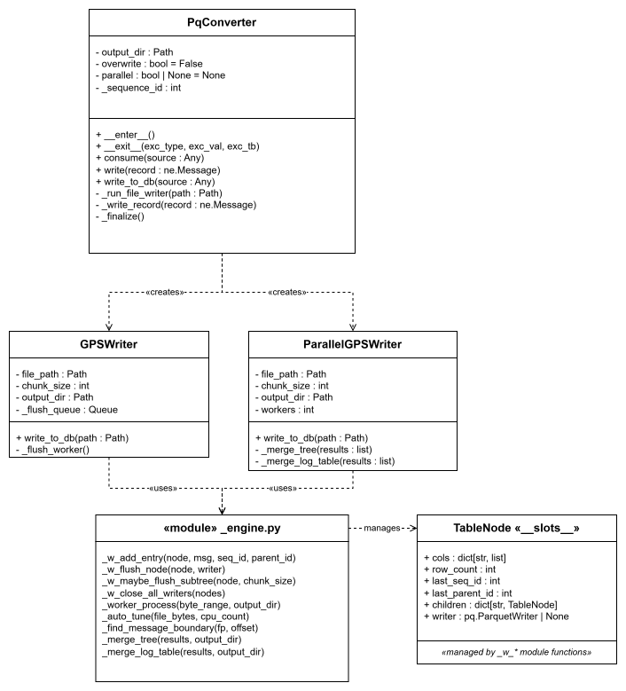
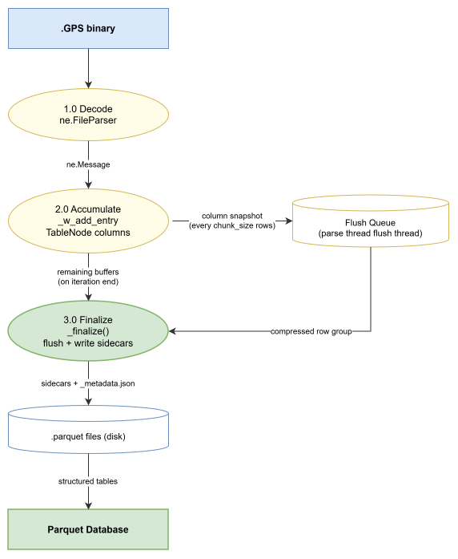
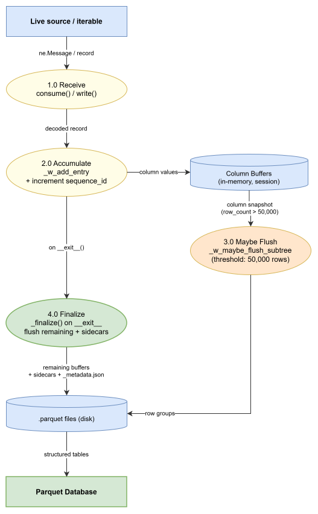
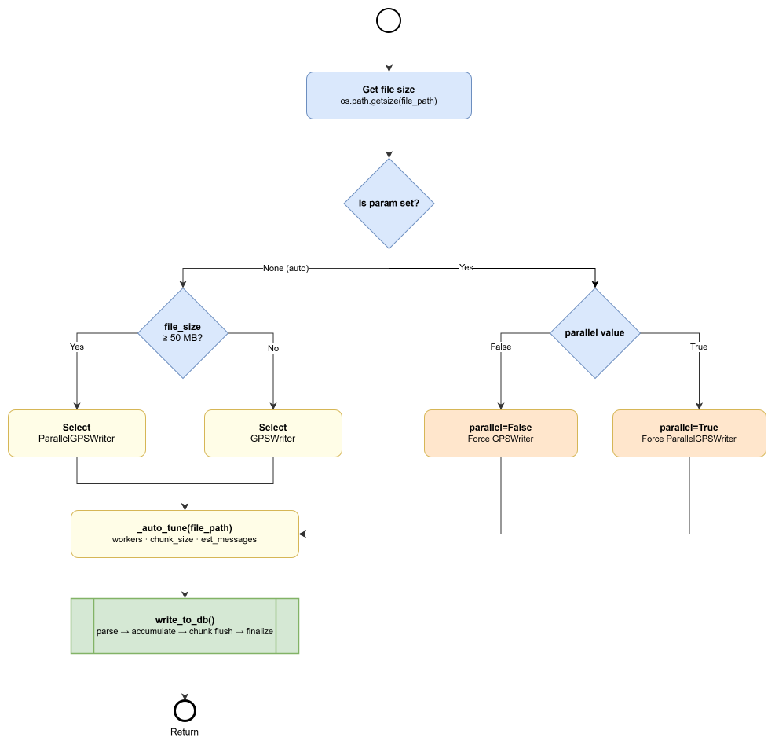

# nov_gnsspq Writer Subsystem: High Level Design

## Component Overview

The writer subsystem converts NovAtel GPS log files (or real-time message
streams) into a structured Parquet database. The output is a directory tree
where each NovAtel message type occupies its own subdirectory and Parquet file,
with nested sub-message types stored as child tables linked by `parent_id`
foreign keys.

The subsystem is designed around two complementary goals:

1. **Throughput on large files**: parallelise decode work across CPU cores,
   overlapping disk I/O with computation.
2. **Correctness of the relational identity columns
   ** (`sequence_id`, `parent_id`) across independently-processed byte ranges
   when workers are merged.




---

## Module Responsibilities

### `PqConverter`

`PqConverter` is the sole public entry point for all write operations,
implemented as a context manager. On entry, it validates the output directory
and guards against accidental overwrites, raising `DatabaseExistsError`
when `_metadata.json` is already present and `overwrite=False`. It detects
whether the input is a raw file path, a `ne.FileParser` instance, or a generic
iterable, then routes accordingly: in file mode it delegates
to `_run_file_writer`, which selects either `GPSWriter` or `ParallelGPSWriter`
based on file size or the `parallel` override flag; in streaming mode it
accumulates records directly via `_write_record` and finalises the database
on `__exit__`. The class owns the streaming-mode `sequence_id` counter and the
in-memory log and unknown column accumulators.

### `GPSWriter`

`GPSWriter` is the single-threaded writer for files below the parallel
threshold (default: < 50 MB) or when forced with `parallel=False`. It opens and
iterates a `ne.FileParser` over the entire file on the main thread, dispatching
each decoded `ne.Message` into the `TableNode` tree via `_add_entry` to populate
columnar buffers. Column snapshots are enqueued to a background flush
thread (`_flush_worker`) every `chunk_size` rows; the background thread owns the
complete `pq.ParquetWriter` lifecycle, decoupling disk I/O from parsing
throughput. The `log_table` and `unknown_data` tables are accumulated in memory
and written atomically at the end of the file, alongside a `_metadata.json`
sidecar containing the SHA-256 digest, file size, message count, and schema
version.

### `nov_gnsspq/writer/protocols.py` (Protocol Interfaces)

`protocols.py` defines the three structural typing interfaces for the parallel
file-processing engine: `BoundarySplitter`, `ChunkProcessor`,
and `ResultMerger`. Each is declared as a `typing.Protocol` decorated
with `@runtime_checkable`, which means conformance is structural:
implementations do not inherit from the protocol, they simply provide the
required method signatures. The file has no intra-package imports, so callers
can import these types without triggering EDIE or PyArrow dependency resolution.
All three protocols carry a pickling constraint: implementations are serialised
across `ProcessPoolExecutor` process boundaries and must therefore hold only
picklable configuration state (strings, ints, booleans, `Path` objects), with no
open file handles, locks, or threading primitives.

### `ParallelGPSWriter`

`ParallelGPSWriter` is the multiprocess writer for files at or above the
parallel threshold (default: >= 50 MB) or when forced with `parallel=True`. It
is a thin wrapper around `ParallelFileEngine`: the constructor builds the three
default EDIE+Parquet
components (`EdieFramerSplitter`, `EdieChunkProcessor`, `ParquetMerger`) and
passes them to the engine, while `write_to_db` handles the concerns the engine
deliberately excludes: SHA-256 computation, `_metadata.json` serialisation, and
the small-file fallback to `GPSWriter`. If the file is smaller
than `PARALLEL_MIN_BYTES` at runtime, `ParallelGPSWriter` delegates
to `GPSWriter` without invoking the engine.

### `engine.py` (Parallel Engine Core)

`engine.py` contains the generic parallel file-processing infrastructure and the
default EDIE+Parquet implementations of the three protocol interfaces.

1. `ParallelFileEngine` is the generic orchestrator. 
- It accepts optional `splitter`, `processor`, and `merger` arguments; when any are `None` it
substitutes the default EDIE+Parquet implementations. 
- Its `run` method divides the file into equal-sized candidate offsets, snaps each interior boundary
via `splitter.snap_boundary`, dispatches one worker per slice
through `ProcessPoolExecutor`, sorts results by `worker_id`, and
calls `merger.merge`. 
- The engine is responsible for worker count resolution,
temporary directory lifecycle, progress display, and wrapping any worker
exception as `ParallelEngineError` with `worker_id` and `byte_range` attributes. 
- It does not write `_metadata.json`, compute SHA-256, or fall back to
single-threaded processing; those are caller responsibilities.

2. `EdieFramerSplitter` 
- Wraps `_find_message_boundary` (which uses `novatel_edie.Framer`) to snap candidate byte offsets to valid NovAtel
message starts. 
3. `EdieChunkProcessor`
- Wraps `_worker_process`, the picklable
top-level function submitted to each worker process; it handles byte-range
extraction into a temp file, EDIE decoding, `TableNode` accumulation,
incremental Parquet flushing, and building the `WorkerResult`
dict. 
4. `ParquetMerger` 
- Wraps the `_merge_*` family of functions, reassembling
per-worker Parquet outputs with corrected `sequence_id` and `parent_id` offsets
into the final output directory.
5. `WorkerResult`
- Is a `TypedDict` documenting the return value of `EdieChunkProcessor.
  process`. It is exported from `nov_gnsspq.writer` so that
Tier 1 callers who supply a custom `ResultMerger` alongside the default
processor have a typed description of what their `merge` method will receive.

The module also provides `_auto_tune` (derives worker count and chunk size from
file size and CPU count) and shared constants. `TableNode`, the per-table-type
columnar accumulation node, and all `_w_*` module-level helpers remain in this
module because they must be importable by a stable module path to
satisfy `multiprocessing` pickle requirements.

---

## Class Structure



`PqConverter` is the sole public entry point. It creates either `GPSWriter`
or `ParallelGPSWriter` at runtime based on file size (or the `parallel`
override), and in streaming mode drives the engine functions directly without a
writer instance. Both writer classes delegate all per-row buffer management and
I/O to the shared functions in `_engine.py`. `ParallelGPSWriter` and `GPSWriter`
are not part of the public API; callers who need to customise parallel
processing use `ParallelFileEngine` directly.

`ParallelFileEngine` is the pluggable parallel orchestrator. Callers who want
custom decoding, custom storage, or support for non-NovAtel binary formats
construct an engine with their own `BoundarySplitter`, `ChunkProcessor`,
and/or `ResultMerger` implementations and
call `engine.run(file_path, output_dir)` directly. The three protocol interfaces
are exported from `nov_gnsspq.writer` and have no intra-package imports, so they
can be imported without pulling in EDIE or PyArrow.

`TableNode` is the central data structure inside the EDIE processing path. One
instance exists per unique message type (and per unique sub-record type)
encountered during a session. Its `__slots__` layout keeps attribute access fast
on the hot path. All mutations to `TableNode` go through the `_w_*` module-level
functions in `_engine.py`; these must be module-level (not methods) to remain
picklable across `ProcessPoolExecutor` worker boundaries.

---

## Public API Contract

`PqConverter` exposes three public methods, all of which require an active
context (`with` block):

| Method                | Description                                                                                |
|-----------------------|--------------------------------------------------------------------------------------------|
| `consume(source)`     | Accepts a file path, `FileParser`, or any iterable of records. Selects mode automatically. |
| `write(record)`       | Adds a single record in streaming mode.                                                    |
| `write_to_db(source)` | Explicitly invokes file-mode writing from a path or `FileParser`.                          |

**Constructor parameters:**

| Parameter    | Type           | Default  | Effect                                                                                                              |
|--------------|----------------|----------|---------------------------------------------------------------------------------------------------------------------|
| `output_dir` | `str \| Path`  | required | Destination directory for the Parquet tree                                                                          |
| `overwrite`  | `bool`         | `False`  | Allow writing into an existing nov_gnsspq directory                                                                 |
| `parallel`   | `bool \| None` | `None`   | Force writer selection; `None` = auto based on file size                                                            |
| `zip_output` | `bool`         | `False`  | Compress the output directory into `{output_dir}.zip` (ZIP_DEFLATED) after writing; original directory is preserved |

The context manager raises `DatabaseExistsError` on `__enter__` if the output
directory already contains `_metadata.json` and `overwrite=False`. It
raises `WriteError` (wrapping `OSError`) if a filesystem error occurs during the
write.

---

## Data Flow: File Mode



1. Caller invokes `consume(file_path)` or `write_to_db(file_path)` inside
   a `with` block.
2. `_run_file_writer` measures file size, selects `GPSWriter`
   or `ParallelGPSWriter`, and calls `write_to_db()` on it.
3. A `ne.FileParser` iterates over the decoded message stream.
4. For each `ne.Message`, the header dict is extracted and its fields are
   prefixed with `header_`. The combined dict is passed
   to `_add_entry` / `_w_add_entry`, which routes each field value into the
   columnar buffer of the appropriate `TableNode`. Nested dicts and lists of
   dicts are recursed into child `TableNode` objects, each assigned
   a `parent_id` referencing the enclosing row's `sequence_id`.
5. Every 500 messages, a flush check runs: if the active node's `row_count`
   exceeds `chunk_size`, the column buffers are snapshotted and handed to the
   flush thread (standard) or flushed in-process (parallel worker).
6. After iteration, remaining buffers are flushed and all `pq.ParquetWriter`
   handles are closed.
7. Sidecar tables are written: `log_table.parquet` (sequence-ordered log-type
   index) and `unknown_data.parquet` (unrecognised message payloads).
8. `_metadata.json` is written with SHA-256 digest, source file size, total
   message count, `schema_version`, and `writer_version`.

---

## Data Flow: Streaming Mode



Streaming mode is used when `consume()` receives a live `ne.FileParser` whose
file path cannot be resolved, or any other iterable.

1. Each call to `consume(iterable)` drains available records by
   calling `_write_record` per record.
2. `_write_record` appends to in-memory column buffers via `_w_add_entry` and
   increments a session-global `sequence_id`. Every record triggers
   a `_w_maybe_flush_subtree` check (threshold: 50,000 rows).
3. `log_table` and `unknown_data` columns are accumulated in-memory across the
   entire session.
4. On `__exit__` (with no active exception), `_finalize` flushes all remaining
   buffers, writes the sidecar tables, and writes `_metadata.json`. The
   streaming metadata omits SHA-256 and file size because there is no single
   source file.

Streaming mode is designed for real-time or incremental ingestion where the
total file size is unknown in advance. It trades the parallelism of file mode
for a zero-latency record-by-record API.

---

## Auto-Selection and Tuning



### Writer Selection (`_run_file_writer`)

| Condition                                | Writer selected                          |
|------------------------------------------|------------------------------------------|
| `parallel=None` and `file_size < 50 MB`  | `GPSWriter`                              |
| `parallel=None` and `file_size >= 50 MB` | `ParallelGPSWriter`                      |
| `parallel=True`                          | `ParallelGPSWriter` (regardless of size) |
| `parallel=False`                         | `GPSWriter` (regardless of size)         |

### Auto-Tune Formula (`_auto_tune`)

Given `cpu_count` and `file_bytes`:

```
workers    = clamp(cpu_count - 1, min=2, max=8)
est_msgs   = file_bytes // 500
raw_chunk  = est_msgs // (workers * 8)
chunk_size = clamp(raw_chunk, min=20_000, max=200_000)

if file_bytes > 1 GB:
    chunk_size = max(chunk_size, 200_000)
```

The `workers * 8` divisor targets roughly 8 row groups per worker, giving a
reasonable balance between flush frequency and memory usage. The 1 GB floor
overrides the clamp to ensure large files always use the maximum row group size,
reducing Parquet file fragmentation.

### Key Configuration Constants

| Constant                  | Value        | Location                       | Meaning                                                 |
|---------------------------|--------------|--------------------------------|---------------------------------------------------------|
| `PARALLEL_MIN_BYTES`      | 50 MB        | `_engine.py`                   | File size threshold for parallel mode auto-selection    |
| `_1_GB`                   | 1 GB         | `_engine.py`                   | Threshold above which `chunk_size` is forced to 200,000 |
| `chunk_size` min          | 20,000 rows  | `_auto_tune`                   | Minimum row group size                                  |
| `chunk_size` max          | 200,000 rows | `_auto_tune`                   | Maximum row group size                                  |
| `workers` min             | 2            | `_auto_tune`                   | Minimum parallel processes                              |
| `workers` max             | 8            | `_auto_tune`                   | Maximum parallel processes                              |
| Flush check interval      | 500 messages | `_worker_process`, `GPSWriter` | How often chunk threshold is evaluated                  |
| Streaming flush threshold | 50,000 rows  | `_write_record`                | Chunk size used in streaming mode                       |
| Default compression       | `zstd` L3    | all writers                    | Parquet compression codec                               |
| `SCHEMA_VERSION`          | `"1"`        | `schema.py`                    | Written to `_metadata.json`                             |
| `WRITER_VERSION`          | `"1.0.0"`    | `schema.py`                    | Written to `_metadata.json`                             |

---

## Output Structure

The writer produces a directory of Parquet files, one per NovAtel message type,
plus a small set of fixed sidecar files.

**Root directory** (`{db_name}.parquet/`) contains:

| File / path                   | Description                                                                                                       |
|-------------------------------|-------------------------------------------------------------------------------------------------------------------|
| `_metadata.json`              | SHA-256 digest, source path, `schema_version`, `writer_version`                                                   |
| `log_table.parquet`           | Flat index of every message in arrival order: `log_type`, `sequence_id`                                           |
| `{LOG}/{LOG}.parquet`         | One file per flat message type (e.g. `BESTPOS`). Columns: `sequence_id` (PK), `header_*` fields, body fields      |
| `{LOG}/{LOG}.parquet` + child | For messages with nested sub-records (e.g. `RANGE`), the parent table and each sub-record type get their own file |
| `unknown_data.parquet`        | Payloads the decoder could not identify (omitted if empty)                                                        |

**Parent / child relationship:** the RANGE message carries a variable-length
list of satellite observations. The writer stores the RANGE header and body
fields in `RANGE/RANGE.parquet` and the per-observation fields
in `RANGE/obs/obs.parquet`. The child table's `parent_id` column is a foreign
key into the parent table's `sequence_id` column, enabling a standard equi-join:

---

## Parallel Merge Strategy

After all worker futures complete, `ParallelGPSWriter` runs a four-phase merge
to assemble the final database from N temporary worker output trees.

**Phase 1: Data table merge (`_merge_tree`)**

`_merge_tree` walks the union of all message types produced by any worker. For
each type it:

1. Reads each worker's Parquet file for that type.
2. Computes a `seq_offset` for each worker as the cumulative row count of all
   preceding workers for that type.
3. Adds `seq_offset` to all `sequence_id` values in that worker's slice, and
   adds the corresponding `parent_seq_offset` to all `parent_id` values.
4. Concatenates the offset-corrected tables with `pa.concat_tables`
   using `promote_options="default"` to handle schema evolution across workers.
5. Writes the merged result to the final output directory.
6. Recurses into child subtable trees, passing the per-worker `sequence_id` row
   counts as the next level's parent offsets.

The distinction between root nodes (no `parent_id` column) and leaf nodes
determines which columns receive offset adjustments, preventing
double-correction at intermediate levels.

**Phase 2: Log table merge (`_merge_log_table`)**

The log table is a flat `(log_type, sequence_id)` index covering every message
in arrival order. Each worker's log table has `sequence_id` values starting from
0. The merge adds each worker's cumulative global message offset before
concatenation. The total message count returned by this function is written
to `_metadata.json`.

**Phase 3: Unknown sidecar merge**

`_merge_unknown_table` applies the same global offset correction to
the `unknown_data` sidecar table.

**Phase 4: Cleanup**

The entire temporary worker directory tree (`tmp_base`) is removed
unconditionally inside a `finally` block, regardless of whether the merge
succeeded or raised an exception.

---

## Parallel Engine Extension Points

`ParallelFileEngine` exposes three pluggable seams that callers can replace
independently. The default behaviour (NovAtel EDIE decoding with Apache Parquet
storage) requires no arguments; every parameter is optional and falls back to
the built-in implementation.

### Protocol Interfaces

| Protocol           | Method                                                                 | Responsibility                                                                                                                                                   |
|--------------------|------------------------------------------------------------------------|------------------------------------------------------------------------------------------------------------------------------------------------------------------|
| `BoundarySplitter` | `snap_boundary(file_path, candidate_offset) -> int`                    | Return the byte offset of the nearest valid record start at or after `candidate_offset`. Return EOF offset if none exists (signals a zero-length chunk to skip). |
| `ChunkProcessor`   | `process(file_path, start_byte, end_byte, worker_id, temp_dir) -> Any` | Decode and store one byte-range slice. Write intermediate output under `temp_dir`. Return a value passed verbatim to `ResultMerger.merge`.                       |
| `ResultMerger`     | `merge(worker_results, output_dir) -> None`                            | Combine per-worker outputs into the final result under `output_dir`.                                                                                             |

All three implementations must be picklable, holding only primitive
configuration state with no open handles or locks. The `@runtime_checkable`
decorator on each protocol permits `isinstance` checks at runtime.

### Customisation Tiers

**Tier 0: unchanged behaviour**

```python
with PqConverter("output/") as db:
    db.consume("recording.GPS")
```

No changes required. `PqConverter` and `ParallelGPSWriter`
use `EdieFramerSplitter`, `EdieChunkProcessor`, and `ParquetMerger` internally.

**Tier 1: custom storage, keep EDIE decoding**

Supply a custom `ResultMerger` to write decoded EDIE data to a different
backend (database, custom file format, cloud storage). The merger receives
a `list[WorkerResult]`; import `WorkerResult` from `nov_gnsspq.writer` for the
typed schema.

```python
from nov_gnsspq.writer import ParallelFileEngine, WorkerResult
from pathlib import Path


class MyDatabaseMerger:
    def merge(self, worker_results: list[WorkerResult],
              output_dir: Path) -> None:
        for result in worker_results:
            # read result["table_tree"] and write to your backend
            ...


engine = ParallelFileEngine(merger=MyDatabaseMerger())
engine.run("recording.GPS", "output/")
```

**Tier 2: custom decoder and storage, keep EDIE boundary detection**

Supply a custom `ChunkProcessor` and `ResultMerger` when the message format is
NovAtel-framed but the decoding or storage logic differs.

```python
from nov_gnsspq.writer import ParallelFileEngine
from pathlib import Path
import json


class JsonChunkProcessor:
    def __init__(self, schema_filter: list[str]):
        self._filter = schema_filter  # picklable primitive

    def process(self, file_path: Path, start_byte: int, end_byte: int,
                worker_id: int, temp_dir: Path) -> Path:
        out = temp_dir / f"w{worker_id}.json"
        # decode byte range, write JSON to out
        out.write_text(json.dumps([...]))
        return out


class JsonMerger:
    def merge(self, worker_results: list[Path], output_dir: Path) -> None:
        records = []
        for path in worker_results:
            records.extend(json.loads(path.read_text()))
        (output_dir / "result.json").write_text(json.dumps(records))


engine = ParallelFileEngine(
    processor=JsonChunkProcessor(schema_filter=["BESTPOS", "RANGE"]),
    merger=JsonMerger(),
)
engine.run("recording.GPS", "output/")
```

**Tier 3: fully custom (different binary format)**

Supply all three components to process a non-NovAtel binary format. The splitter
must locate valid record boundaries in the custom framing; the processor decodes
one byte range; the merger assembles the outputs.

```python
from nov_gnsspq.writer import ParallelFileEngine
from pathlib import Path


class MyFrameSplitter:
    def snap_boundary(self, file_path: Path, candidate_offset: int) -> int:
        # scan for your frame sync bytes at or after candidate_offset
        ...


class MyProcessor:
    def process(self, file_path: Path, start_byte: int, end_byte: int,
                worker_id: int, temp_dir: Path):
        ...


class MyMerger:
    def merge(self, worker_results, output_dir: Path) -> None:
        ...


engine = ParallelFileEngine(
    splitter=MyFrameSplitter(),
    processor=MyProcessor(),
    merger=MyMerger(),
)
engine.run("custom_format.bin", "output/")
```

### Default Implementations

| Class                | Protocol           | Constructor Args            | Wraps                                                                         |
|----------------------|--------------------|-----------------------------|-------------------------------------------------------------------------------|
| `EdieFramerSplitter` | `BoundarySplitter` | —                           | `_find_message_boundary` via `novatel_edie.Framer`                            |
| `EdieChunkProcessor` | `ChunkProcessor`   | `chunk_size`, `compression` | `_worker_process` + `TableNode` accumulation                                  |
| `ParquetMerger`      | `ResultMerger`     | `compression`               | `_merge_tree`, `_merge_log_table`, `_merge_unknown_table`, `_merge_raw_table` |

`compression` is passed to both `EdieChunkProcessor` and `ParquetMerger` when
constructing from `ParallelGPSWriter`, so per-worker write compression and final
merged write compression remain consistent.

---

## Key Design Decisions

### Why `_worker_process` must live in `_engine.py`

Python's `multiprocessing` module transfers work to child processes
via `pickle`. Only module-level functions are picklable; a function nested
inside a class or defined in `__main__` cannot be pickled.
Because `_worker_process` is submitted to `ProcessPoolExecutor`, it must be
importable by name from a stable module path. Keeping it (and all `_w_*` helpers
it calls) in `_engine.py` satisfies this constraint while isolating the engine
from the higher-level orchestration in `_standard.py` and `_parallel.py`.

### Why a background flush thread in `GPSWriter`

Disk I/O is the slowest operation in the pipeline. By routing
all `pq.ParquetWriter.write_table` calls through a `queue.Queue` to a dedicated
daemon thread, the main thread can continue parsing the next batch of messages
while the previous row group is being serialised and compressed. This overlap of
CPU-bound parsing and I/O-bound writing delivers meaningful throughput
improvement on spinning disks and avoids stalling on network-attached storage.

### Why `TableNode.__slots__`

`TableNode` instances are allocated once per unique message type seen in the
file, but their
attributes (`cols`, `row_count`, `last_seq_id`, `last_parent_id`) are accessed
on the hot path for every row of every message. Using `__slots__` instead of the
default `__dict__` eliminates the per-instance dictionary lookup, yielding
approximately 20% faster attribute access, a significant gain when processing
millions of rows.

### Why `sequence_id` offset correction in the merge step

Each parallel worker independently numbers its rows starting from 0. If the
outputs were concatenated without correction, every message type in the final
database would have duplicate `sequence_id` values and broken `parent_id`
foreign keys. The merge step adds the cumulative row count of all preceding
workers to each worker's IDs, producing a globally unique, contiguous integer
sequence in the merged output. Crucially, the offset applied to `parent_id` at
each tree level is derived from the row counts of the parent table (one level
up), not the child table itself, preserving referential integrity across the
hierarchy.

### Why zstd compression (default L3)

zstd at level 3 is 3–5x faster to compress than Brotli at comparable compression
ratios. For a write-heavy pipeline where the database may be rewritten
repeatedly during development or data collection, compression speed dominates
over marginal size differences. zstd also decompresses faster than most
alternatives, which matters for the downstream reader workload. The codec is
configurable (`compression` parameter on all writers) but defaults to `"zstd"`
throughout.

### Schema design: `header_` prefix and `_raw` integer columns

NovAtel message headers share field names (e.g., `week`, `milliseconds`) with
some message body fields. Prefixing all header-derived columns with `header_`
eliminates name collisions and makes the provenance of every column unambiguous
to readers. For enumeration fields, the writer stores both the human-readable
string (the column itself) and the raw integer (`{field}_raw`), so consumers can
filter efficiently on integers without parsing strings, while retaining human
readability in tools that display column values directly.
